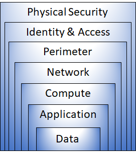

### Defense-in-depth

The objective of defense-in-depth is to protect information and prevent it from being stolen by those who aren't authorized to access it.

You can visualize defense-in-depth as a set of layers, with the data to be secured at the center and all the other layers functioning to protect that central data layer.

Here's a brief overview of the role of each layer:

- The physical security layer is the first line of defense to protect computing hardware in the datacenter.
- The identity and access layer controls access to infrastructure and change control.
- The perimeter layer uses distributed denial of service (DDoS) protection to filter large-scale attacks before they can cause a denial of service for users.
- The network layer limits communication between resources through segmentation and access controls.
- The compute layer secures access to virtual machines.
- The application layer helps ensure that applications are secure and free of security vulnerabilities.
- The data layer controls access to business and customer data that you need to protect.